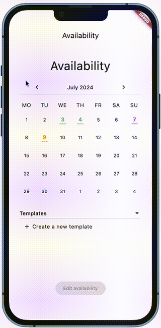

# flutter_availability

This package creates an all encompassing implementation for handling time availability use cases. By Default this package runs with a local data implementation that does not persist data. You can add your own implementation by implementing the AvailabilityDataInterface.

All configuration of the userstory is done through the AvailabilityOptions class.



Figma Design that defines this component (only accessible for Iconica developers): TO BE CREATED
Figma clickable prototype that demonstrates this component (only accessible for Iconica developers): TO BE CREATED

## Setup

To use this package, add flutter_availability as a dependency in your pubspec.yaml file:

```
  flutter_availability:
    git:
      url: https://github.com/Iconica-Development/flutter_availability
      path: packages/flutter_availability
      ref: 1.0.0
```

You can start the userstory by adding the availability widget like this to your widget tree:

```dart
AvailabilityUserStory(
    userId: "userIdOfTheUser",
    options: AvailabilityOptions(),
),
```
There is also a function for pushing the availability screen to the navigation stack:

```dart
openAvailabilitiesForUser(context, "userIdOfTheUser", AvailabilityOptions());
```

## Issues

Please file any issues, bugs or feature request as an issue on our [GitHub](https://github.com/Iconica-Development/flutter_availability) page. Commercial support is available if you need help with integration with your app or services. You can contact us at [support@iconica.nl](mailto:support@iconica.nl).

## Want to contribute
[text](about:blank#blocked)
If you would like to contribute to the plugin (e.g. by improving the documentation, solving a bug or adding a cool new feature), please carefully review our [contribution guide](./CONTRIBUTING.md) and send us your [pull request](https://github.com/Iconica-Development/flutter_availability/pulls).

## Author

This flutter_availability for Flutter is developed by [Iconica](https://iconica.nl). You can contact us at <support@iconica.nl>